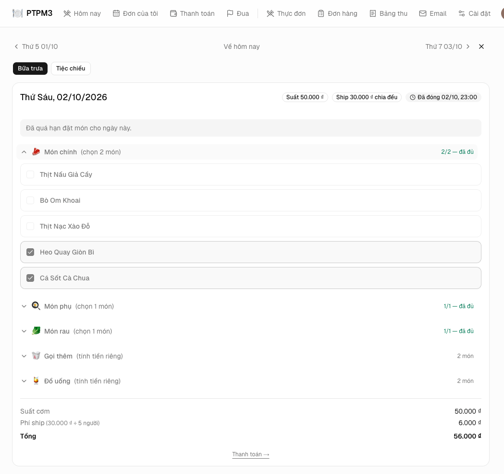
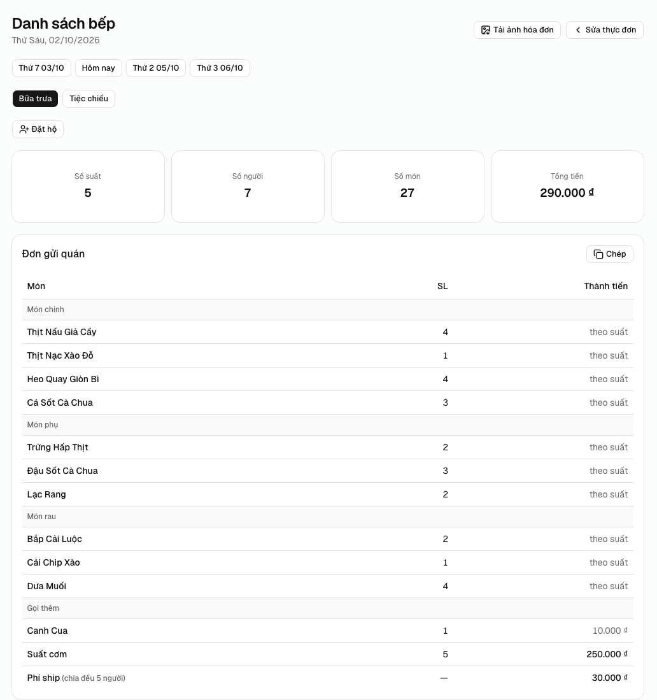
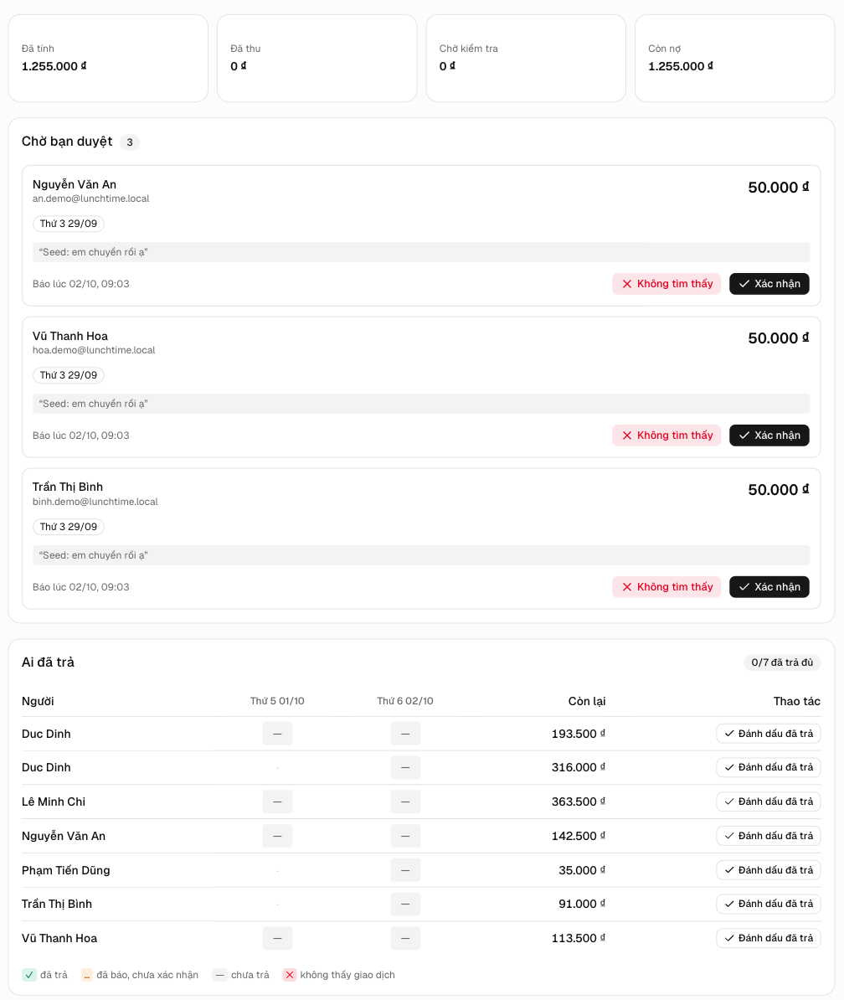
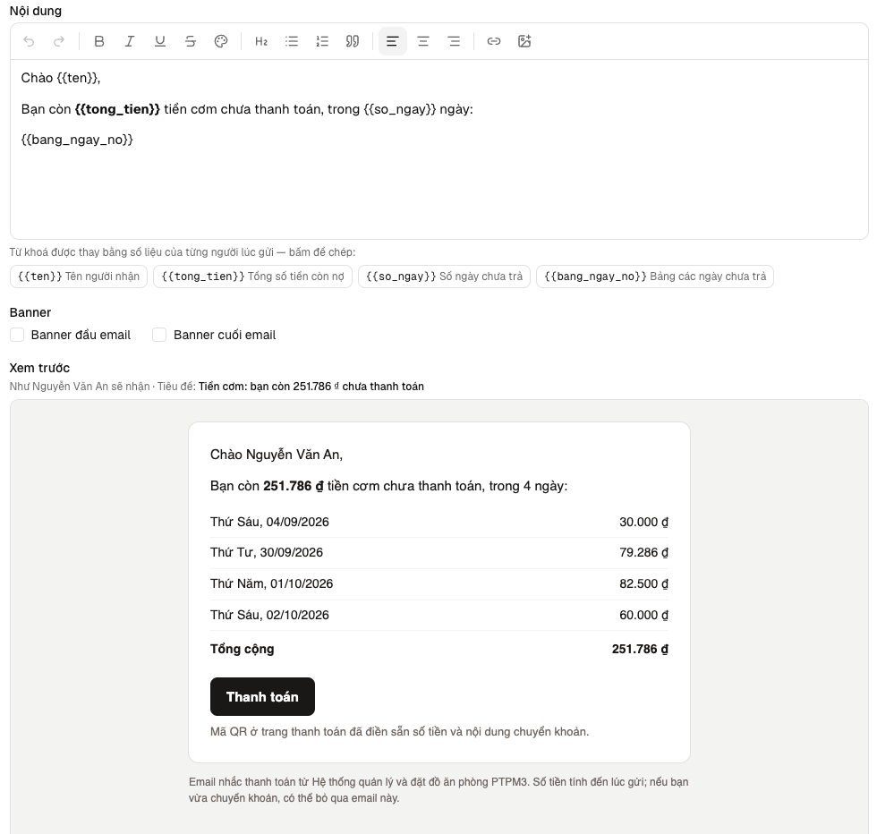

# 🍽️ Lunch Time — office lunch ordering & payment tracker

Post a menu, let your team book, get paid by **VietQR** bank transfer, and see who still owes — in one small web app.

[](https://nextjs.org)
[](https://www.typescriptlang.org)
[](https://orm.drizzle.team)
[](https://clerk.com)
[](LICENSE)

| Book lunch | Kitchen list |
|---|---|
|  |  |
| **Payment roster** | **Billing emails** |
|  |  |

## Features

- 📋 **Daily menus** — set meals (*suất*) or per-dish pricing, plus a second sitting for after-work parties
- ⏰ **Cutoff times** — orders lock automatically; the kitchen list is ready to copy to the restaurant
- 💸 **VietQR payments** — QR with amount and memo pre-filled; admin confirms each transfer
- 📊 **Payment roster** — everyone × every day: paid, claimed or unpaid
- ✉️ **Email reminders** — send now or schedule, editable text with `{{placeholders}}`, full send history
- 🎁 **Extras** — lucky-money (*lì xì*) and birthday discounts

## Quick start

Requires **Node 20+** and **pnpm**.

```bash
pnpm install
pnpm db:local      # local Postgres in .localdb/
pnpm db:migrate    # create tables
pnpm setup         # wizard: Clerk keys, admin email, bank details → .env.local
pnpm dev           # http://localhost:3000
```

Then sign up with your admin email → **Thực đơn** → add dishes → open the day.

> No Clerk account yet? `npx clerk@latest init --accountless` creates dev keys for you.
> Every setting is documented in [`.env.local.example`](.env.local.example).

## Deploy (Vercel)

1. Import the repo and copy your env vars into Vercel.
2. Run `pnpm db:migrate` against the production `DATABASE_URL` — Vercel does not migrate.
3. For scheduled emails, call `GET /api/cron/emails` every 5 min with `Authorization: Bearer $CRON_SECRET` (e.g. [cron-job.org](https://cron-job.org)).

## Scripts

| Command | Does |
|---|---|
| `pnpm dev` | Dev server |
| `pnpm build` | Production build + typecheck |
| `pnpm db:generate` | New migration after editing `src/db/schema.ts` |
| `pnpm db:studio` | Browse the data |
| `pnpm db:seed-demo` | Fill a week of demo orders |
| `pnpm db:verify` | Data-layer checks — ⚠️ **wipes the database**, scratch DBs only |

## Stack

Next.js 15 (App Router, Server Actions) · React 19 · TypeScript · Drizzle ORM · PostgreSQL / Neon · Clerk · Tailwind CSS · shadcn/ui (Base UI) · Nodemailer · Vercel

**How it works →** [`CLAUDE.md`](CLAUDE.md) explains the architecture and the rules the data model protects (price snapshots, integer money, Vietnam time, …).

## License

[MIT](LICENSE)
